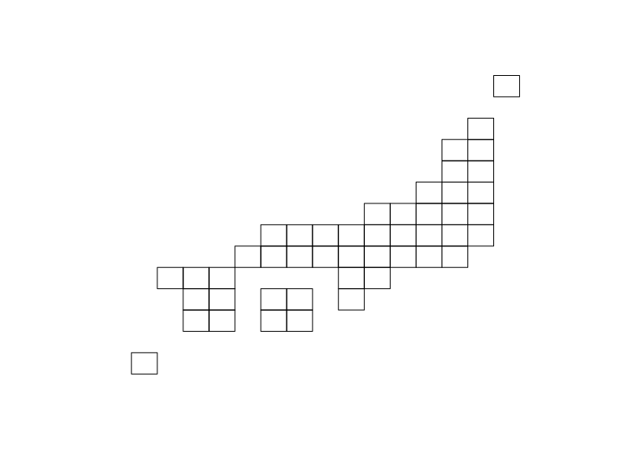
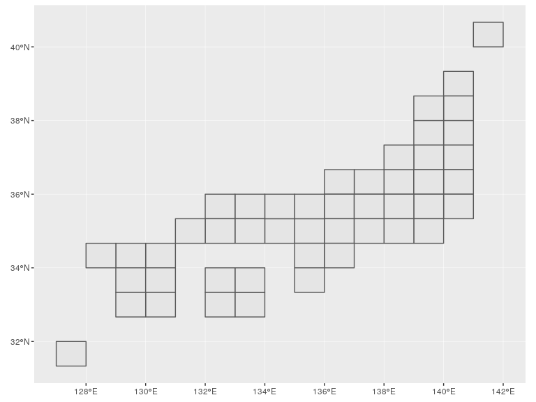
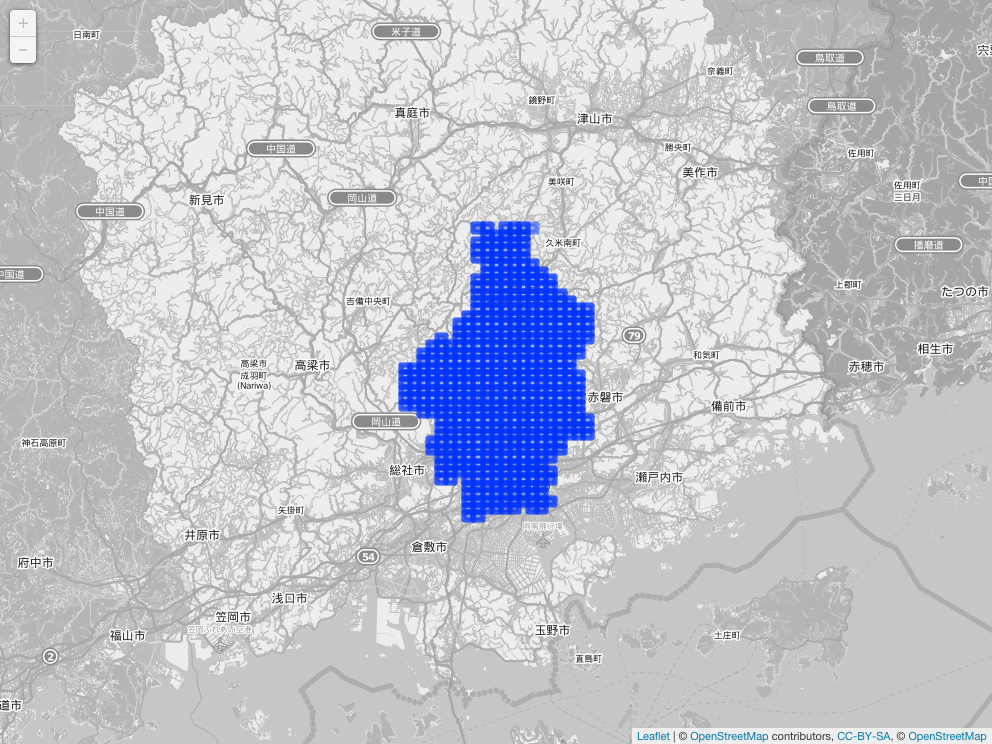

<!-- README.md is generated from README.Rmd. Please edit that file -->
jpmesh 
====================================================================

[](https://cran.r-project.org/package=jpmesh) [](https://cran.r-project.org/package=jpmesh) [](https://cran.r-project.org/) [](http://depsy.org/package/r/jpmesh)

[](https://travis-ci.org/uribo/jpmesh) [](https://app.wercker.com/project/byKey/25d5f835882cf2185751e1d89370269f) [](https://codecov.io/github/uribo/jpmesh?branch=master)

------------------------------------------------------------------------

[](https://www.tidyverse.org/lifecycle/#maturing) [](https://github.com/uribo/jpmesh)

Overview
--------

The **jpmesh** package is a package that makes it easy to use "regional mesh (i.e. mesh code *JIS X 0410* )" used in Japan from R. Regional mesh is a code given when subdividing Japanese landscape into rectangular subregions by latitude and longitude. Depending on the accuracy of the code, different regional mesh length. By using the same mesh in statistical survey etc., it will become possible to handle the survey results of a large area in the area mesh unit.

In jpmesh, mesh codes and latitude and longitude coordinates are compatible with mesh codes from the first region mesh, which is the standard region mesh, to the quarter regional mesh of the divided region mesh (from 80 km to 125 m). Features include "conversion from latitude and longitude to regional mesh", "acquisition of latitude and longitude from regional mesh", "mapping on prefecture unit and leaflet".

Installation
------------

From CRAN

``` r
# latest update 2018-02-25
install.packages("jpmesh")
```

For developers

``` r
# the development version from GitHub:
install.packages("devtools")
devtools::install_github("uribo/jpmesh")
```

Usage
-----

``` r
library(jpmesh)
```

### Convert mesh code to coordinate and vice versa

Return the latitude and longitude for specifying the mesh range from the mesh code.

``` r
mesh_to_coords(5133) # 80km
#> # A tibble: 1 x 4
#>   lng_center lat_center lng_error lat_error
#>        <dbl>      <dbl>     <dbl>     <dbl>
#> 1       134.       34.3     0.500     0.333
mesh_to_coords(513377) # 10km
#> # A tibble: 1 x 4
#>   lng_center lat_center lng_error lat_error
#>        <dbl>      <dbl>     <dbl>     <dbl>
#> 1       134.       34.6    0.0625    0.0417
mesh_to_coords(51337783) # 1km
#> # A tibble: 1 x 4
#>   lng_center lat_center lng_error lat_error
#>        <dbl>      <dbl>     <dbl>     <dbl>
#> 1       134.       34.7   0.00625   0.00417
mesh_to_coords(513377831) # 500m
#> # A tibble: 1 x 4
#>   lng_center lat_center lng_error lat_error
#>        <dbl>      <dbl>     <dbl>     <dbl>
#> 1       134.       34.7   0.00312   0.00208
mesh_to_coords(5133778312) # 250m
#> # A tibble: 1 x 4
#>   lng_center lat_center lng_error lat_error
#>        <dbl>      <dbl>     <dbl>     <dbl>
#> 1       134.       34.7   0.00156   0.00104
mesh_to_coords(51337783123) # 125m
#> # A tibble: 1 x 4
#>   lng_center lat_center lng_error lat_error
#>        <dbl>      <dbl>     <dbl>     <dbl>
#> 1       134.       34.7  0.000781  0.000521
```

Find the mesh code within the range from latitude and longitude.

``` r
coords_to_mesh(133, 34) # default as 1km meshcode
#> [1] "51330000"
coords_to_mesh(133, 34, mesh_size = "80km")
#> [1] "5133"
coords_to_mesh(133, 34, mesh_size = "125m")
#> [1] "51330000111"
```

### Detect fine and neighborhood mesh codes

``` r
# Returns a finer mesh of the area of the mesh codes
# Such as, 80km to 10km mesh codes.
coords_to_mesh(133, 34, "80km") %>% 
  fine_separate()
#>  [1] "513300" "513301" "513302" "513303" "513304" "513305" "513306"
#>  [8] "513307" "513310" "513311" "513312" "513313" "513314" "513315"
#> [15] "513316" "513317" "513320" "513321" "513322" "513323" "513324"
#> [22] "513325" "513326" "513327" "513330" "513331" "513332" "513333"
#> [29] "513334" "513335" "513336" "513337" "513340" "513341" "513342"
#> [36] "513343" "513344" "513345" "513346" "513347" "513350" "513351"
#> [43] "513352" "513353" "513354" "513355" "513356" "513357" "513360"
#> [50] "513361" "513362" "513363" "513364" "513365" "513366" "513367"
#> [57] "513370" "513371" "513372" "513373" "513374" "513375" "513376"
#> [64] "513377"

# the value of the adjacent mesh codes
coords_to_mesh(133, 34, "80km") %>% 
  neighbor_mesh()
#> [1] "5032" "5033" "5034" "5132" "5133" "5134" "5232" "5233" "5234"
coords_to_mesh(133, 34, "500m") %>% 
  neighbor_mesh()
#> [1] "503277994" "503370903" "503370904" "513207092" "513207094" "513300003"
#> [7] "513300004" "513300001"
```

### Utilies

Drawing a simplified Japanese map based on the mesh code.

``` r
library(sf)
#> Linking to GEOS 3.6.1, GDAL 2.1.3, proj.4 4.9.3
plot(jpnrect["abb_name"])
```



``` r
library(ggplot2) # 2.2.1.9000
ggplot() +
  geom_sf(data = jpnrect)
```



Dataset of mesh code for prefectures.

``` r
set.seed(71)
administration_mesh(code = 33, type = "prefecture") %>% 
  dplyr::sample_n(5) %>% 
  knitr::kable()
```

|     | meshcode |  lng\_center|  lat\_center|  lng\_error|  lat\_error| geometry                                                                                            |
|-----|:---------|------------:|------------:|-----------:|-----------:|:----------------------------------------------------------------------------------------------------|
| 33  | 523440   |     134.0625|     35.04167|      0.0625|   0.0416667| list(c(134, 134.125, 134.125, 134, 134, 35, 35, 35.08333, 35.08333, 35))                            |
| 54  | 523322   |     133.3125|     34.87500|      0.0625|   0.0416667| list(c(133.25, 133.375, 133.375, 133.25, 133.25, 34.83333, 34.83333, 34.91667, 34.91667, 34.83333)) |
| 32  | 523377   |     133.9375|     35.29167|      0.0625|   0.0416667| list(c(133.875, 134, 134, 133.875, 133.875, 35.25, 35.25, 35.33333, 35.33333, 35.25))               |
| 21  | 513355   |     133.6875|     34.45833|      0.0625|   0.0416667| list(c(133.625, 133.75, 133.75, 133.625, 133.625, 34.41667, 34.41667, 34.5, 34.5, 34.41667))        |
| 30  | 523357   |     133.9375|     35.12500|      0.0625|   0.0416667| list(c(133.875, 134, 134, 133.875, 133.875, 35.08333, 35.08333, 35.16667, 35.16667, 35.08333))      |

Example)

``` r
# For leaflet
library(leaflet)
leaflet() %>% 
  addTiles() %>% 
  addProviderTiles("OpenStreetMap.BlackAndWhite") %>% 
  addPolygons(data = administration_mesh(code = 33101, type = "city"))
```



``` r
ggplot() + 
  geom_sf(data = administration_mesh(code = 33, type = "city"))
```


Code of Conduct
---------------

Please note that this project is released with a [Contributor Code of Conduct](CODE_OF_CONDUCT.md). By participating in this project you agree to abide by its terms.
