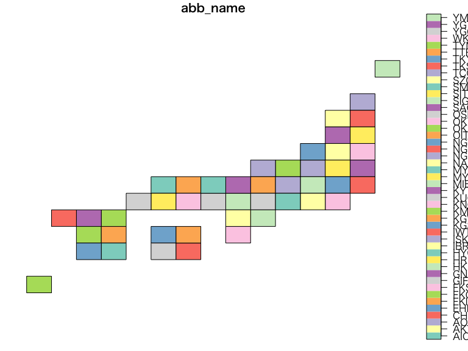

<!-- README.md is generated from README.Rmd. Please edit that file -->
jpmesh 
========================================================

[](https://travis-ci.org/uribo/jpmesh) [](https://cran.r-project.org/package=jpmesh) [](https://cran.r-project.org/package=jpmesh)[](https://codecov.io/gh/uribo/jpmesh)

Overview
--------

The **`{jpmesh}`** package is a package that makes it easy to use "regional mesh (i.e. mesh code *JIS X 0410* )" used in Japan from R. Regional mesh is a code given when subdividing Japanese landscape into rectangular subregions by latitude and longitude. Depending on the accuracy of the code, different regional mesh length. By using the same mesh in statistical survey etc., it will become possible to handle the survey results of a large area in the area mesh unit.

In jpmesh, mesh codes and latitude and longitude coordinates are compatible with mesh codes from the first region mesh, which is the standard region mesh, to the quarter regional mesh of the divided region mesh (from 80 km to 125 m). Features include "conversion from latitude and longitude to regional mesh", "acquisition of latitude and longitude from regional mesh", "mapping on prefecture unit and leaflet".

Installation
------------

Fron CRAN

``` r
install.packages("jpmesh")
```

For developers

``` r
# the development version from GitHub:
install.packages("devtools")
devtools::install_github("uribo/jpmesh")
```

Usage
-----

``` r
library(jpmesh)
library(dplyr, warn.conflicts = FALSE)
```

### Convert mesh code to coordinate and vice versa

Return the latitude and longitude for specifying the mesh range from the mesh code.

``` r
mesh_to_coords(5133) # 80km
#> # A tibble: 1 x 4
#>   lng_center    lat_center lng_error    lat_error
#>        <dbl>         <dbl>     <dbl>        <dbl>
#> 1      133.5 34.3333333333       0.5 0.3333333333
mesh_to_coords(513377) # 10km
#> # A tibble: 1 x 4
#>   lng_center lat_center lng_error       lat_error
#>        <dbl>      <dbl>     <dbl>           <dbl>
#> 1   133.9375     34.625    0.0625 0.0416666666667
mesh_to_coords(51337783) # 1km
#> # A tibble: 1 x 4
#>   lng_center    lat_center        lng_error        lat_error
#>        <dbl>         <dbl>            <dbl>            <dbl>
#> 1  133.91875 34.6541666667 0.00624999999999 0.00416666669999
mesh_to_coords(513377831) # 500m
#> # A tibble: 1 x 4
#>   lng_center    lat_center lng_error     lat_error
#>        <dbl>         <dbl>     <dbl>         <dbl>
#> 1 133.915625 34.6520833334  0.003125 0.00208333335
mesh_to_coords(5133778312) # 250m
#> # A tibble: 1 x 4
#>    lng_center lat_center lng_error      lat_error
#>         <dbl>      <dbl>     <dbl>          <dbl>
#> 1 133.9140625  34.653125 0.0015625 0.001041666675
mesh_to_coords(51337783123) # 125m
#> # A tibble: 1 x 4
#>     lng_center    lat_center         lng_error         lat_error
#>          <dbl>         <dbl>             <dbl>             <dbl>
#> 1 133.91484375 34.6526041667 0.000781249999999 0.000520833337499
```

Find the mesh code within the range from latitude and longitude.

``` r
coords_to_mesh(133, 34) # default as 1km meshcode
#> [1] "51330000"
coords_to_mesh(133, 34, mesh_size = "80km")
#> [1] "5133"
coords_to_mesh(133, 34, mesh_size = "125m")
#> [1] "51330000111"
```

### Detect fine and neighborhood mesh codes

``` r
# Returns a finer mesh of the area of the mesh codes
# Such as, 80km to 10km mesh codes.
coords_to_mesh(133, 34, "80km") %>% 
  fine_separate()
#>  [1] "513311" "513312" "513313" "513314" "513315" "513316" "513317"
#>  [8] "513318" "513321" "513322" "513323" "513324" "513325" "513326"
#> [15] "513327" "513328" "513331" "513332" "513333" "513334" "513335"
#> [22] "513336" "513337" "513338" "513341" "513342" "513343" "513344"
#> [29] "513345" "513346" "513347" "513348" "513351" "513352" "513353"
#> [36] "513354" "513355" "513356" "513357" "513358" "513361" "513362"
#> [43] "513363" "513364" "513365" "513366" "513367" "513368" "513371"
#> [50] "513372" "513373" "513374" "513375" "513376" "513377" "513378"
#> [57] "513381" "513382" "513383" "513384" "513385" "513386" "513387"
#> [64] "513388"

# the value of the adjacent mesh codes
coords_to_mesh(133, 34, "80km") %>% 
  find_neighbor_mesh()
#> [1] 5032 5033 5034 5132 5133 5134 5232 5233 5234
coords_to_mesh(133, 34, "500m") %>% 
  find_neighbor_mesh()
#> [1] 513299894 513299903 513299904 513299992 513299994 513300001 513300002
#> [8] 513300003 513300004
```

### Utilies

Drawing a simplified Japanese map based on the mesh code.

``` r
library(sf)
#> Linking to GEOS 3.6.1, GDAL 2.1.3, proj.4 4.9.3
plot(jpnrect["abb_name"])
```



``` r
library(ggplot2) # 2.2.1.9000
ggplot() +
  geom_sf(data = jpnrect)
```


Dataset of mesh code for prefectures.

``` r
set.seed(71)
administration_mesh(code = 33, type = "prefecture") %>% 
  dplyr::sample_n(5) %>% 
  knitr::kable()
```

|     | meshcode |  lng\_center|    lat\_center|  lng\_error|      lat\_error| geometry                                                                                                                                                  |
|-----|:---------|------------:|--------------:|-----------:|---------------:|:----------------------------------------------------------------------------------------------------------------------------------------------------------|
| 33  | 523440   |     134.0625|  35.0416666667|      0.0625|  0.041666666700| 134.0000000000, 134.1250000000, 134.1250000000, 134.0000000000, 134.0000000000, 35.0000000000, 35.0000000000, 35.0833333334, 35.0833333334, 35.0000000000 |
| 54  | 523322   |     133.3125|  34.8750000000|      0.0625|  0.041666666667| 133.2500000000, 133.3750000000, 133.3750000000, 133.2500000000, 133.2500000000, 34.8333333333, 34.8333333333, 34.9166666667, 34.9166666667, 34.8333333333 |
| 32  | 523377   |     133.9375|  35.2916666667|      0.0625|  0.041666666700| 133.8750000000, 134.0000000000, 134.0000000000, 133.8750000000, 133.8750000000, 35.2500000000, 35.2500000000, 35.3333333334, 35.3333333334, 35.2500000000 |
| 21  | 513355   |     133.6875|  34.4583333333|      0.0625|  0.041666666633| 133.6250000000, 133.7500000000, 133.7500000000, 133.6250000000, 133.6250000000, 34.4166666667, 34.4166666667, 34.4999999999, 34.4999999999, 34.4166666667 |
| 30  | 523357   |     133.9375|  35.1250000000|      0.0625|  0.041666666667| 133.8750000000, 134.0000000000, 134.0000000000, 133.8750000000, 133.8750000000, 35.0833333333, 35.0833333333, 35.1666666667, 35.1666666667, 35.0833333333 |

Example)

``` r
# For leaflet
library(leaflet)
leaflet() %>% addTiles() %>% 
  addProviderTiles("OpenStreetMap.BlackAndWhite") %>% 
  addPolygons(data = administration_mesh(code = 33101, type = "city"))
```


``` r
ggplot() + 
  geom_sf(data = administration_mesh(code = 33, type = "city"))
```


